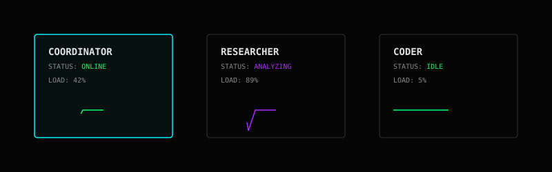
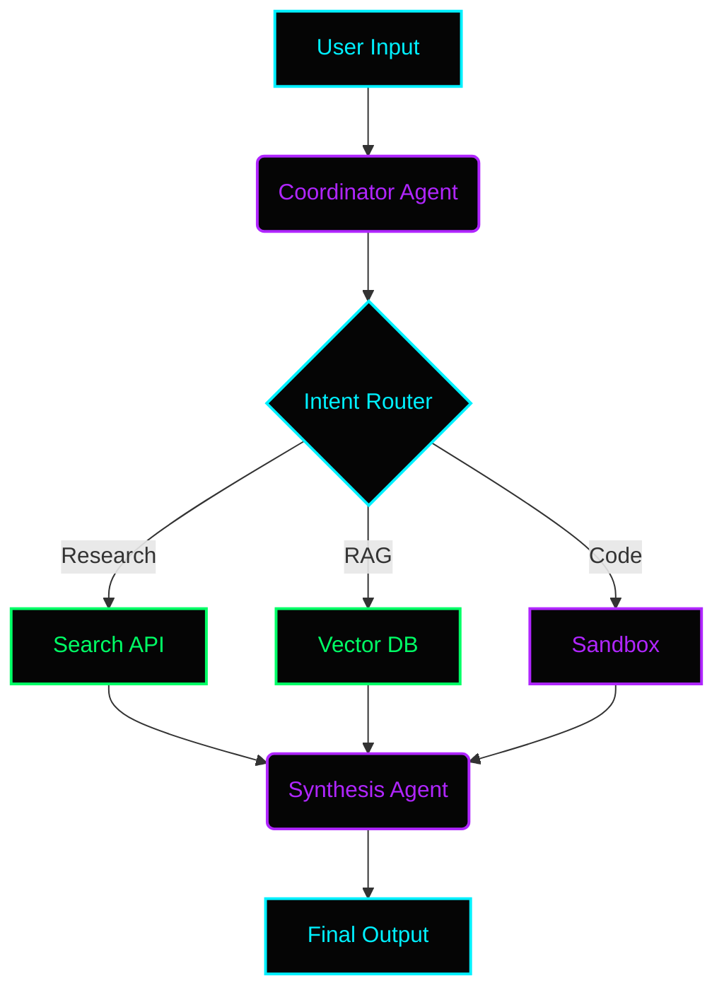
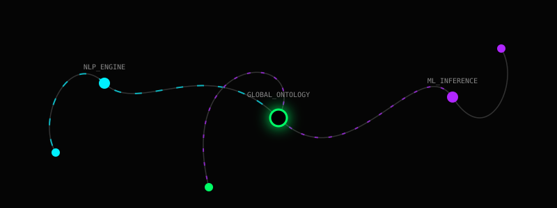
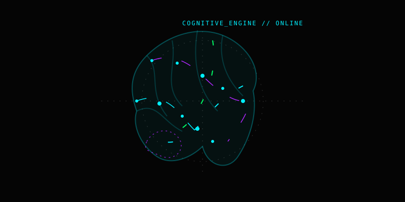

  

 

  

 

## ⬡ NEURAL STATUS DASHBOARD

<table width="100%" style="border: none; background-color: #050505;">
  <tr style="border: none;">
    <td width="60%" style="border: none; background-color: #050505;">
      
    </td>
    <td width="40%" style="border: none; background-color: #050505; padding-left: 20px;">
      <h3 style="color: #00F0FF; font-family: monospace; margin-top: 0;">SYSTEM METRICS</h3>
      

        <strong>STATUS:</strong> ONLINE 
        <strong>LATENCY:</strong> 12ms 
        <strong>MEMORY:</strong> 256TB 
        <strong>COMPUTE:</strong> OPTIMAL
      

        
        
      
    </td>
  </tr>
</table>

 

## ⬡ LIVE AGENT DASHBOARD

  

 

## ⬡ CURRENT DEPLOYED MODULES

  

<table width="100%">
  <tr>
    <td width="50%">
      <h4 style="color: #00F0FF;">MODULE_001: Enterprise RAG</h4>
      <pre style="background-color: #0A0A0A; color: #00FF66; border: 1px solid #333;">
Status:   ONLINE
Latency:  130ms
Memory:   8GB
Accuracy: 97%
      </pre>
    </td>
    <td width="50%">
      <h4 style="color: #B026FF;">MODULE_002: Coordinator Agent</h4>
      <pre style="background-color: #0A0A0A; color: #00FF66; border: 1px solid #333;">
Status:   ONLINE
Latency:  45ms
Memory:   2GB
Accuracy: 99%
      </pre>
    </td>
  </tr>
</table>

 

## ⬡ AI ARCHITECTURE DIAGRAM

 

## ⬡ KNOWLEDGE GRAPH

  

 

## ⬡ VECTOR DATABASE (RAG)

  

 

## ⬡ NEURAL ACTIVITY (CONTRIBUTIONS)

  

*Integrated visual representation of recent semantic commits and AI interactions.*

 

## ⬡ AI ENGINEER DATA ARCHIVE

  
[+] SECTION_01: EDUCATION & CERTIFICATIONS

  <pre style="background-color: #050505; color: #E0E0E0; padding: 15px; border-left: 2px solid #00F0FF; margin-top: 0;">
🎓 B.S. in Computer Science & Artificial Intelligence
🎓 Certified Machine Learning Engineer
🎓 Applied Generative AI Specialist
  </pre>

  
[+] SECTION_02: CORE AI SKILLS

  <pre style="background-color: #050505; color: #E0E0E0; padding: 15px; border-left: 2px solid #00FF66; margin-top: 0;">
- LLM Orchestration & Prompt Engineering
- RAG (Retrieval-Augmented Generation) Architecture
- Agentic AI & Multi-Agent Systems
- Vector Databases & Semantic Search
- Voice-First AI & Speech-to-Text pipelines
  </pre>

  
[+] SECTION_03: TECHNOLOGY STACK

  <pre style="background-color: #050505; color: #E0E0E0; padding: 15px; border-left: 2px solid #B026FF; margin-top: 0;">
LANGUAGES : Python, TypeScript, SQL, Bash
AI MODELS : OpenAI GPT-4, Anthropic Claude 3.5, Google Gemini, Groq, LLaMA
FRAMEWORKS: LangChain, LangGraph, LlamaIndex, FastAPI, React
DEVOPS    : Docker, AWS, Celery, Redis, Qdrant, Pinecone
  </pre>

 

## ⬡ DEPLOYMENT LOGS

  

 

## ⬡ INTERACTIVE TERMINAL

  
> help

  <pre style="background-color: #050505; color: #E0E0E0; padding: 15px; border-left: 2px solid #00F0FF;">
AVAILABLE COMMANDS:
- about:    Display Manya AI Core specifications
- projects: List active AI research modules
- research: Show current machine learning experiments
- contact:  Initialize communication protocol
  </pre>

  
> about

  <pre style="background-color: #050505; color: #E0E0E0; padding: 15px; border-left: 2px solid #00F0FF;">
MANYA AI CORE v2.0
An advanced autonomous system focused on:
- Multi-Agent Orchestration
- High-Performance Retrieval-Augmented Generation
- Voice-First AI Interfaces
- Zero-Knowledge Security Protocols
  </pre>

  
> research

  <pre style="background-color: #050505; color: #E0E0E0; padding: 15px; border-left: 2px solid #00F0FF;">
CURRENT EXPERIMENTS:
- Sub-100ms Voice-to-Voice latency optimizations
- OCR error correction for low-resource languages
- Physics-based interactive Knowledge Graphs
  </pre>

  
> contact

  <pre style="background-color: #050505; color: #E0E0E0; padding: 15px; border-left: 2px solid #00F0FF;">
COMMUNICATION CHANNELS:
[GitHub](https://github.com/Manya2302)
[LinkedIn](https://linkedin.com/in/manya)
[Email](mailto:hello@example.com)
  </pre>

## ⬡ DETAILED TECH STACK

<table width="100%" style="background-color: #050505; border: none;">
  <tr>
    <td width="33%" valign="top">
      <h4 style="color: #00F0FF;">💻 PROGRAMMING</h4>
      
      
    </td>
    <td width="33%" valign="top">
      <h4 style="color: #00FF66;">🧠 AI & ML</h4>
      
      
      
    </td>
    <td width="33%" valign="top">
      <h4 style="color: #B026FF;">⚙️ BACKEND</h4>
      
      
    </td>
  </tr>
  <tr>
    <td width="33%" valign="top">
      <h4 style="color: #00F0FF;">🗄️ DATABASE</h4>
      
      
    </td>
    <td width="33%" valign="top">
      <h4 style="color: #00FF66;">☁️ CLOUD & DEVOPS</h4>
      
      
    </td>
    <td width="33%" valign="top">
      <h4 style="color: #B026FF;">🛠️ TOOLS</h4>
      
      
    </td>
  </tr>
</table>

 

## ⬡ FEATURED AI PROJECTS

<table width="100%" style="background-color: #050505; color: #E0E0E0; border: 1px solid #333;">
  <tr style="background-color: #0A0A0A; color: #00F0FF;">
    <th align="left">PROJECT</th>
    <th align="left">DESCRIPTION</th>
  </tr>
  <tr>
    <td>🤖 <strong>AI Interview Assistant</strong></td>
    <td>Mock interviews powered by LLMs</td>
  </tr>
  <tr>
    <td>📄 <strong>Resume Analyzer</strong></td>
    <td>ATS Resume Scoring using AI</td>
  </tr>
  <tr>
    <td>📚 <strong>PDF Chatbot</strong></td>
    <td>Chat with PDFs using RAG</td>
  </tr>
  <tr>
    <td>💬 <strong>AI Customer Support</strong></td>
    <td>Intelligent chatbot with memory</td>
  </tr>
  <tr>
    <td>🧠 <strong>AI Agent</strong></td>
    <td>Autonomous task execution</td>
  </tr>
  <tr>
    <td>🎙 <strong>Voice Assistant</strong></td>
    <td>Speech-to-AI pipeline</td>
  </tr>
</table>

 

## ⬡ AI SKILLS PROFICIENCY

<pre style="background-color: #050505; color: #00FF66; padding: 15px; border-left: 2px solid #00FF66;">
Python                 ████████████████████ 95%
Machine Learning       █████████████████░░ 90%
Generative AI          ██████████████████░ 92%
LLMs                   ██████████████████░ 92%
FastAPI                █████████████████░░ 90%
RAG                    ████████████████░░░ 85%
Cloud                  ██████████████░░░░░ 80%
</pre>

 

## ⬡ GITHUB ANALYTICS

  
    
  
    
  <!-- GitHub Snake Animation Placeholder -->
  

 

## ⬡ AI TERMINAL

<pre style="background-color: #050505; color: #E0E0E0; padding: 15px; border-left: 2px solid #B026FF;">
visitor@github:~$ whoami
> AI Engineer

visitor@github:~$ skills
> Python, Machine Learning, LLMs, LangChain, FastAPI, AI Agents, RAG

visitor@github:~$ currently_working
> Building intelligent AI applications...

visitor@github:~$ status
> Ready for collaboration 🚀
</pre>

 

## ⬡ CONNECT WITH ME

  
  
  

 

  

    💡 "Artificial Intelligence is not replacing developers. Developers using AI will replace those who don't."
  

  

    ⭐ Thanks for visiting my profile!
  

  

## ⬡ SECURITY OVERWATCH

  

  

  

